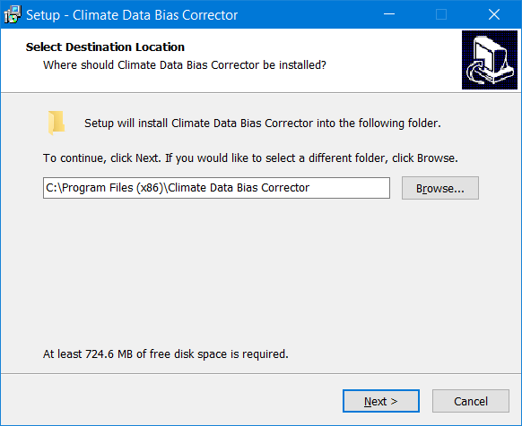
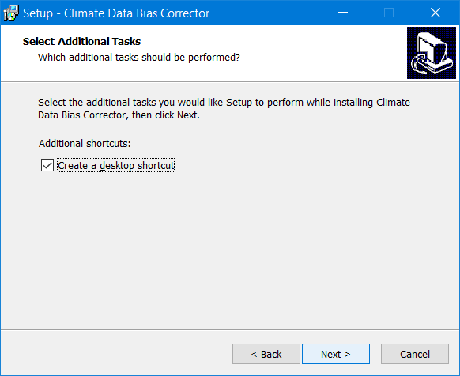
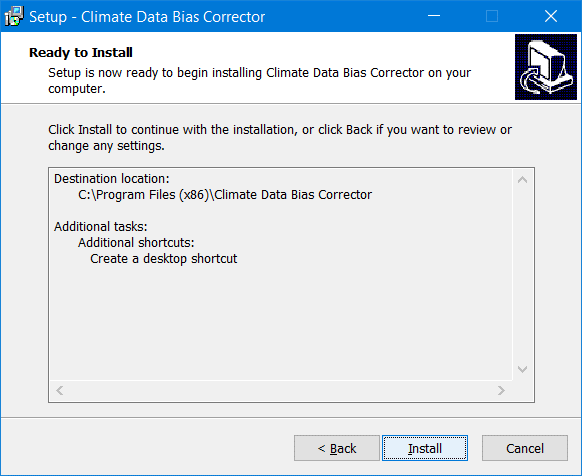
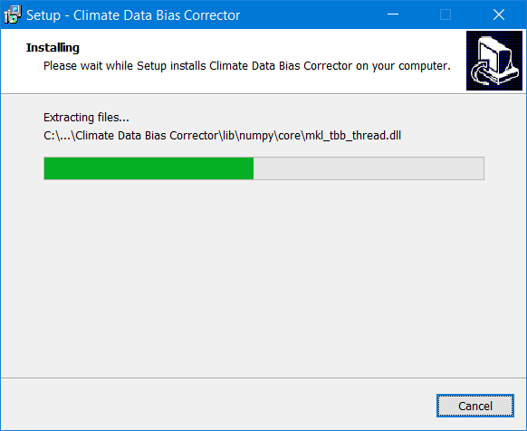
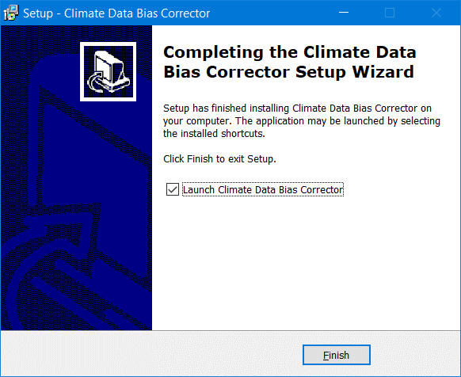

# Getting Started
- [Overview](#Overview)
- [Installation](#Installation)
- [Technical Manual](#Technical-Manual)
- [License](#License)
---
### Overview  
The Climate Data Bias Corrector tool is developed for removing the bias from Global Climate Model (GCM)/Regional Climate Model (RCM) derived outputs of climate variables- precipitation, temperature and solar radiation for the historical as well as the future period. The tool is developed using a free and open-source widget toolkit- PyQt available in Python. The source codes of the tool can be found at [Source Code](/Source%20Codes) folder which are feasible to modify/update in future for further improvement of used as well as the addition of new methodologies to remove the bias from GCM/RCM projections.  
  
### Installation  
The tool is easy to install in all the versions of Windows and does not require any supporting software for its installation. The installable executable file can be downloaded from [CDBC Google Drive](https://drive.google.com/open?id=1O-U5EXd0AfxrTmqwoWvdpKn7CUIy1ygs). Following are the steps to install in Windows:  
- Run the CDBC.exe 
- Select the destination folder to install the tool

- Check 'Create a desktop shortcut' if desktop shortcut for the tool is needed

- Click Install and wait for installation to complete

- Check 'Launch Climate Data Bias Corrector' to launch it immediately and Click 'Finish'

  
### Technical Manual 
The technical manual provides the step-by-step procedure about the tool working and the input file format description. For the technical manual, please click [Technical Manual](Technical Manual) 

### License
© Agro-Climatic Tools  
Licensed under the [MIT License](LICENSE) 
