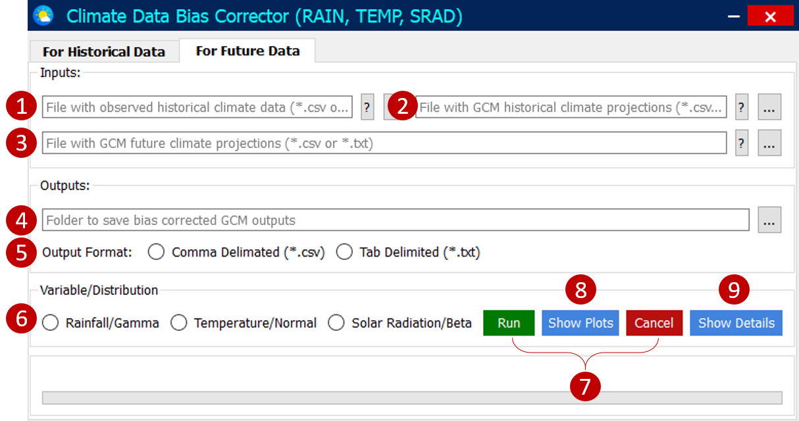

# Technical Manual
- [CDBC Methodology - Quantile Mapping](#CDBC-Methodology:-Quantile-Mapping)
- [Climate Data Bias Corrector (CDBC): GUI (Graphical User Interface)](#Climate-Data-Bias-Corrector-(CDBC):-GUI-(Graphical-User-Interface))
- [File Format](#File-Format)
- [Simulation Setups](#Simulation-Setups)
---

Before leading to this document, please make sure that you have install the Climate Data Bias Corrector tool. If you have not installed it, please refer to [README](README.md) to get the overview of the tool and installation procedure.

### CDBC Methodology: Quantile Mapping
Quantile mapping approach has been used due to its simplicity, effectiveness and low computational cost for development of the CDBC tool for bias correction of climate models’ outputs. Quantile mapping approach (also known as ‘probability mapping’ and ‘distribution mapping’) comprised of development of the statistical relationship between observed and model simulated outputs by replacing the simulated values with observed ones at same cumulative density function (CDF) of used distribution depending on the climate variable. Please refer to Table 1 for more detail.

Table 1 Distributions and equations used for bias correction of different climatic variables

**Note**: where x is climatic variable, $\bar{x}_{ms.corr}$ is bias corrected model simulated data; to categories between the wet and the dry day threshold value x_th is used (day with precipitation greater than 1 mm is assumed to be a wet day); $F$ is CDF whereas $F^{-1}$ is its inverse. (o = observed, m = model, h = historical period, and s = simulation period). Here, the simulated period can either be historical or a future period.

### Climate Data Bias Corrector (CDBC): GUI (Graphical User Interface)
CDBC tool has two separate tabs in its GUI for bias correction of historical (Figure 1) and future (Figure 2) data. Both the tabs are divided into three groups: 'Input', 'Output' and 'Variable/Distribution' for taking input, providing output folder location and proding the method for particular variable, respectively. To check the feasibility of tool, it provides an option to visualize the CDF plot which draws for the randomly select station/grid for all the months.

  
*Figure 1 GUI of CDBC: Historical Tab*

  
*Figure 2 GUI of CDBC: Future Tab*

### File Format
CDBC takes input and provides output in a commonly used tab and comma delimited files (*.txt and *.csv) which can easily be done using Microsoft Excel. The first two rows of the files must be latitude and longitude, and the first column must be the date column. Other columns will have the data of the same variable for given latitude and longitude. All the files must have the same order of latitude and longitude. For observed, model simulated historical and future data, three separate files has to be made in the format as described and shown in Figure 3. For each climatic variable, a separate set of files and simulation have to be performed. 

  
*Figure 3 File format in Excel*

### Simulation Setups
 In the historical tab, a user has to input two files, one with daily observed data and other with daily model-simulated historical data (uncorrected/raw) of the same time span (30 years, a general recommendation for climate change studies). Similarly, future tab takes three files for bias correction of future data- observed historical data, model-simulated historical data and model simulated future data. Here, observed and model-simulated data must be of the same period to get accurate results.

##### For Historical Data
1. Click on '...' (Browse Button) to add the observed data file (*.csv/ *.txt).
2. Click on '...' (Browse Button) to add the model simulated historical data file (*.csv/ *.txt).
3. Click on '...' (Browse Button) to add the location of folder where the output need to be saved.
4. Select the format in which the output is needed (*.csv/ *.txt).
5. Select the variable for which the bias correction is to be performed.
6. Finally, click 'Run' to perform the bias correction process. If you want to stop it, click 'Cancel'
7. Click 'Show Plots' to check the bias correction performance through cumulative density function (CDF) plot. CDF plot is generated for a randomly selected grid/station among all.
8. Click 'Show Details' to check the progress in detail. However, it is recommended to keep it hidden to avoid time delay in simulation.

  
*Figure 4 Simulation steps to run the CDBC for historical data*

##### For Future Data
1. Click on '...' (Browse Button) to add the observed data file (*.csv/ *.txt).
2. Click on '...' (Browse Button) to add the model simulated historical data file (*.csv/ *.txt).
3. Click on '...' (Browse Button) to add the model simulated future data file (*.csv/ *.txt)..
4. Click on '...' (Browse Button) to add the location of folder where the output need to be saved.
5. Select the format in which the output is needed (*.csv/ *.txt).
6. Select the variable for which the bias correction is to be performed.
7. Finally, click 'Run' to perform the bias correction process. If you want to stop it, click 'Cancel'
8. Click 'Show Plots' to check the bias correction performance through cumulative density function (CDF) plot. CDF plot is generated for a randomly selected grid/station among all.
9. Click 'Show Details' to check the progress in detail. However, it is recommended to keep it hidden to avoid time delay in simulation.

  
*Figure 5 Simulation steps to run the CDBC for future data*
